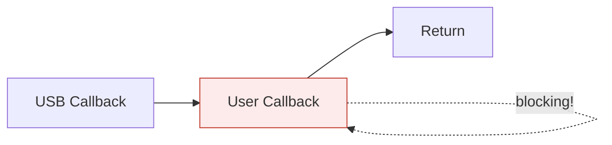
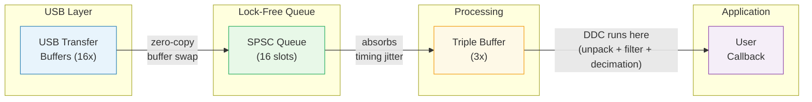

# HydraSDR Host Software

A compact, high-performance, and extensible software defined radio platform.

Host software (Linux/Windows/macOS/FreeBSD/Android) for HydraSDR Software Defined Radio devices.

**Website**: https://www.hydrasdr.com

## Supported Hardware

| Device | Frequency Range | Sample Rate | RF Ports | Special Features |
|--------|-----------------|-------------|----------|------------------|
| **RFOne** | 24 MHz - 1.8 GHz | Up to 10 MSPS | 3 (ANT+bias-tee, CABLE1, CABLE2) | LNA/Mixer/VGA gain |

---

## Quick Start

```c
#include <stdlib.h>
#include <hydrasdr.h>

int callback(hydrasdr_transfer* transfer) {
    float *samples = (float*)transfer->samples;
    // Process I/Q samples...
    return 0;  // Return non-zero to stop
}

int main() {
    struct hydrasdr_device *dev;
    uint32_t count;

    // Open first available device
    hydrasdr_open(&dev);

    // Query available sample rates (device-specific)
    hydrasdr_get_samplerates(dev, &count, 0);
    uint32_t *samplerates = malloc(count * sizeof(uint32_t));
    hydrasdr_get_samplerates(dev, samplerates, count);

    // Configure using first available sample rate
    hydrasdr_set_freq(dev, 100000000);  // 100 MHz
    hydrasdr_set_samplerate(dev, samplerates[0]);
    hydrasdr_set_sample_type(dev, HYDRASDR_SAMPLE_FLOAT32_IQ);

    // Stream
    hydrasdr_start_rx(dev, callback, NULL);
    // ... run until done ...
    hydrasdr_stop_rx(dev);
    hydrasdr_close(dev);
}
```

---

## Key Features

- **Unified API** across all HydraSDR hardware variants
- **Runtime capability discovery** - query device features before use
- **Multiple sample formats**: Float32/Int16/Uint16, IQ or Real
- **High-performance**: Lock-free streaming, callback-based architecture
- **Cross-platform**: Linux, Windows, macOS, FreeBSD, Android

---

## Sample Types

| Type | Description |
|------|-------------|
| `HYDRASDR_SAMPLE_FLOAT32_IQ` | 32-bit float I/Q pairs (default) |
| `HYDRASDR_SAMPLE_INT16_IQ` | 16-bit int I/Q pairs |
| `HYDRASDR_SAMPLE_FLOAT32_REAL` | 32-bit float real samples |
| `HYDRASDR_SAMPLE_INT16_REAL` | 16-bit int real samples |
| `HYDRASDR_SAMPLE_UINT16_REAL` | 16-bit unsigned int real samples |
| `HYDRASDR_SAMPLE_RAW` | Raw ADC samples (format depends on packing setting) |

---

## API Overview

### Device Management
```c
hydrasdr_list_devices()      // Enumerate connected devices
hydrasdr_open() / _open_sn() // Open device
hydrasdr_close()             // Close device
hydrasdr_get_device_info()   // Query capabilities
```

### Pre-streaming Configuration Order (v1.1.0)

**Mandatory**: Call these functions in the order shown for correct auto-bandwidth behavior:

```c
// 1. Query device capabilities first
hydrasdr_get_device_info(dev, &info);

// 2. Query available sample rates (device-specific)
uint32_t sr_count;
hydrasdr_get_samplerates(dev, &sr_count, 0);
uint32_t *samplerates = malloc(sr_count * sizeof(uint32_t));
hydrasdr_get_samplerates(dev, samplerates, sr_count);

// 3. Set frequency
hydrasdr_set_freq(dev, freq_hz);

// 4. Set decimation mode (BEFORE sample rate)
hydrasdr_set_decimation_mode(dev, HYDRASDR_DEC_MODE_HIGH_DEFINITION);

// 5. Set bandwidth (BEFORE sample rate, optional - auto-selected if not called)
hydrasdr_set_bandwidth(dev, bandwidth_hz);

// 6. Set sample rate (LAST - triggers auto-bandwidth if bandwidth not set)
hydrasdr_set_samplerate(dev, samplerates[0]);  // Use queried rate

// 7. Set sample type
hydrasdr_set_sample_type(dev, HYDRASDR_SAMPLE_FLOAT32_IQ);

// 8. Configure gain using unified API (LINEARITY or SENSITIVITY recommended for simplicity)
if (info.features & HYDRASDR_CAP_LINEARITY_GAIN)
    hydrasdr_set_gain(dev, HYDRASDR_GAIN_TYPE_LINEARITY, gain_value);
// Or use SENSITIVITY for weak signals:
// hydrasdr_set_gain(dev, HYDRASDR_GAIN_TYPE_SENSITIVITY, gain_value);

// 9. Start streaming
hydrasdr_start_rx(dev, callback, user_data);
```

### Auto-Bandwidth Selection (v1.1.0)

The library automatically selects optimal RF bandwidth when sample rate is set:
- If `hydrasdr_set_bandwidth()` is **not** called before `hydrasdr_set_samplerate()`,
  the library auto-selects the smallest bandwidth >= **hardware** sample rate
- In High Definition mode (decimation), this ensures the RF filter covers the full ADC bandwidth
- Explicit `hydrasdr_set_bandwidth()` calls override auto-selection

**Manual override tradeoff**: Users can manually select a narrower BW for better out-of-band rejection.
The tuner's IF filter (R820T/R828D) may be slightly off-center when BW doesn't match HW rate,
but this is often acceptable for narrowband applications where the DDC filters handle final bandwidth reduction.

```c
// Query available sample rates and bandwidths first
uint32_t sr_count, bw_count;
hydrasdr_get_samplerates(dev, &sr_count, 0);
uint32_t *samplerates = malloc(sr_count * sizeof(uint32_t));
hydrasdr_get_samplerates(dev, samplerates, sr_count);

hydrasdr_get_bandwidths(dev, &bw_count, 0);
uint32_t *bandwidths = malloc(bw_count * sizeof(uint32_t));
hydrasdr_get_bandwidths(dev, bandwidths, bw_count);

// Auto-bandwidth: library selects optimal BW automatically
hydrasdr_set_samplerate(dev, samplerates[0]);  // Auto-selects appropriate BW

// Manual bandwidth: user controls BW explicitly
hydrasdr_set_bandwidth(dev, bandwidths[0]);    // Set specific BW
hydrasdr_set_samplerate(dev, samplerates[0]);  // Uses manual BW, no auto-selection

// High Definition with manual narrow BW
hydrasdr_set_decimation_mode(dev, HYDRASDR_DEC_MODE_HIGH_DEFINITION);
hydrasdr_set_bandwidth(dev, bandwidths[0]);    // Narrower BW for better rejection
hydrasdr_set_samplerate(dev, samplerates[0]);  // Select desired decimated rate
```

### Streaming
```c
hydrasdr_start_rx()          // Start receiving with callback
hydrasdr_stop_rx()           // Stop receiving
hydrasdr_is_streaming()      // Check status
hydrasdr_get_streaming_stats() // Get streaming statistics (buffers received/processed/dropped)
```

### Capability Discovery

Always query capabilities before using hardware-specific features:

```c
hydrasdr_device_info_t info;
hydrasdr_get_device_info(dev, &info);

if (info.features & HYDRASDR_CAP_VGA_GAIN) {
    hydrasdr_set_vga_gain(dev, info.vga_gain.default_value);
}

if (info.features & HYDRASDR_CAP_BIAS_TEE) {
    hydrasdr_set_rf_bias(dev, 1);  // Enable bias-tee
}
```

### Query Current Configuration (v1.1.0)

`hydrasdr_get_device_info()` can be called at any time, including during streaming, to query current configuration:

```c
hydrasdr_device_info_t info;
hydrasdr_get_device_info(dev, &info);

// Current streaming configuration
printf("Effective rate: %u Hz\n", info.current_samplerate);
printf("Hardware rate:  %u Hz\n", info.current_hw_samplerate);
printf("Decimation:     %ux (%s mode)\n",
       info.current_decimation_factor,
       info.current_decimation_mode ? "High Definition" : "Low Bandwidth");
printf("Bandwidth:      %u Hz (%s)\n",
       info.current_bandwidth,
       info.bandwidth_auto_selected ? "auto" : "manual");
printf("Sample type:    %u\n", info.current_sample_type);
printf("Packing:        %s\n", info.current_packing ? "12-bit" : "16-bit");
```

See `hydrasdr.h` for complete API documentation.

---

## Thread Safety

- Device enumeration/opening: **NOT** thread-safe
- Device control (after open): **Thread-safe**
- Callbacks run in a dedicated thread
  - **Windows**: Elevated to `THREAD_PRIORITY_HIGHEST`
  - **Linux/macOS**: Normal priority (lock-free buffering handles timing jitter)

---

## Streaming Architecture (v1.1.0)

Version 1.1.0 introduces a **decoupled streaming architecture** that provides much more flexibility
for callback processing compared to v1.0.x.

### v1.0.x: Direct Callback (Limited)



In v1.0.x, the user callback ran **inside** the USB callback context:
- Any delay blocked USB transfer resubmission
- Users had to copy data and return immediately
- Processing had to happen in a separate thread
- Slow callbacks caused data loss

### v1.1.0: Decoupled Architecture (Flexible)



**Buffer stages in v1.1.0:**

| Stage | Count | Purpose |
|-------|-------|---------|
| USB Transfer Buffers | 16 | Receive raw ADC data from hardware |
| SPSC Queue | 16 slots | Decouple USB from processing (lock-free) |
| Triple Buffer | 3 | Decouple DDC output from user callback |

In v1.1.0, USB and user callback are **fully decoupled**:
- USB transfers continue independently (never blocked by user code)
- Lock-free SPSC queue provides 16-buffer cushion
- DDC processing (unpack + filter + decimation) runs in consumer thread
- Triple buffer ensures user callback never blocks DDC
- Moderate processing can happen directly in callback

### What You Can Do in the Callback

| Processing Type | v1.0.x | v1.1.0 |
|-----------------|--------|--------|
| Copy to ring buffer | OK | OK |
| FFT (~1-2ms) | Risk of data loss | OK |
| File I/O with occasional stalls | Data loss | OK (queue absorbs bursts) |
| Network send | Risk of data loss | OK |
| Heavy DSP (consistently slow) | Data loss | Data loss (if > buffer rate) |

### Callback Timing Budget

Samples per callback depend on mode (verified at 10 MSPS):

| Mode | Samples/Callback | Buffer Interval |
|------|------------------|-----------------|
| IQ (packing off) | 65,536 IQ pairs | 6.55 ms |
| IQ (packing on) | 49,152 IQ pairs | 4.92 ms |
| REAL (packing off) | 131,072 samples | 13.11 ms |
| REAL (packing on) | 98,304 samples | 9.83 ms |

The SPSC queue holds 16 buffers, giving you this headroom before data loss (default IQ mode):

| Sample Rate | Buffer Interval | Queue Headroom (16 buffers) |
|-------------|-----------------|----------------------------|
| 10 MSPS | ~6.5 ms | **~105 ms** |
| 5 MSPS | ~13 ms | **~210 ms** |
| 2.5 MSPS | ~26 ms | **~420 ms** |

**Important**:
These buffer sizes and timing values may change in future versions.
Do not hardcode them in your application. Always use `transfer->sample_count` to get the actual number of samples per callback.

**Rule of thumb**:
- Your callback can occasionally take up to the queue headroom time without data loss
- For consistent processing, stay under the buffer interval (e.g., <6ms at 10 MSPS)
- If processing consistently exceeds the buffer interval, offload to another thread

### Monitoring for Data Loss

Use `hydrasdr_get_streaming_stats()` to detect if your callback is too slow:

```c
hydrasdr_streaming_stats_t stats;
hydrasdr_get_streaming_stats(dev, &stats);
if (stats.buffers_dropped > 0) {
    printf("WARNING: %llu buffers dropped - callback too slow!\n",
           stats.buffers_dropped);
}
```

The `dropped_samples` field in `hydrasdr_transfer_t` also provides cumulative sample loss count.

---

## Build Instructions

### Linux (Debian/Ubuntu)

```bash
sudo apt-get install build-essential cmake libusb-1.0-0-dev pkg-config git

git clone https://github.com/hydrasdr/hydrasdr-host.git
cd hydrasdr-host && mkdir build && cd build
cmake ../ -DINSTALL_UDEV_RULES=ON
make && sudo make install && sudo ldconfig
```

### Windows (MSYS2/MinGW64)

```bash
pacman -S cmake mingw-w64-x86_64-libusb mingw-w64-x86_64-ninja

git clone https://github.com/hydrasdr/hydrasdr-host.git
cd hydrasdr-host && mkdir build && cd build
cmake ../ -G "Ninja"
cmake --build . --config Release
```

For a release build with install (need need administrative privileges): 
```
cmake --build . --config Release --target install
```

### Windows (Visual Studio 2022)

Dependencies (libusb, pthreads4w) are downloaded automatically via CMake FetchContent.

```bash
git clone https://github.com/hydrasdr/hydrasdr-host.git
cd hydrasdr-host && mkdir build && cd build
cmake ../ -G "Visual Studio 17 2022" -A x64
cmake --build . --config Release
```

For a release build with install (need administrative privileges): 
```
cmake --build . --config Release --target install
```

**Driver**: Windows Vista+ uses automatic WinUSB via WCID.
For older Windows or troubleshooting, use [Zadig](http://sourceforge.net/projects/libwdi/files/zadig).

### macOS

```bash
brew install cmake libusb pkg-config git

git clone https://github.com/hydrasdr/hydrasdr-host.git
cd hydrasdr-host && mkdir build && cd build
cmake .. -DINSTALL_UDEV_RULES=OFF
make && sudo make install
```

For Apple Silicon: add `-DCMAKE_OSX_ARCHITECTURES=arm64`

### FreeBSD

```bash
pkg install git cmake

git clone https://github.com/hydrasdr/hydrasdr-host.git
cd hydrasdr-host && mkdir build && cd build
cmake .. -DLIBUSB_LIBRARIES=/usr/lib/libusb.so
make && sudo make install
```

---

## Command-Line Tools

### Device Information
| Tool | Description |
|------|-------------|
| `hydrasdr_info` | Display device information and capabilities |
| `hydrasdr_list_devices` | List connected HydraSDR devices |
| `hydrasdr_lib_version` | Display library version |

### Streaming
| Tool | Description |
|------|-------------|
| `hydrasdr_rx` | Legacy RF sample recorder (updated from HackRF) |
| `hydrasdr_async_rx` | Modern async receiver example (API usage reference) |

### Configuration
| Tool | Description |
|------|-------------|
| `hydrasdr_calibrate` | Frequency calibration utility |
| `hydrasdr_set_rf_port` | RF port selection |
| `hydrasdr_clockgen` | Clock generator configuration |
| `hydrasdr_rf_frontend` | RF frontend register access |

### GPIO
| Tool | Description |
|------|-------------|
| `hydrasdr_gpio` | GPIO pin control |
| `hydrasdr_gpiodir` | GPIO direction configuration |

### Utility
| Tool | Description |
|------|-------------|
| `hydrasdr_reset` | Reset device |
| `hydrasdr_spiflash` | SPI flash programming |

### Benchmarks
| Tool | Description |
|------|-------------|
| `hydrasdr_api_benchmark` | API and USB latency benchmarking |
| `hydrasdr_ddc_benchmark` | DDC algorithm benchmarking |

---

## libusb Note

MSVC builds automatically download libusb 1.0.29. For other platforms, avoid libusb v1.0.24 due to known issues.

---

## License

Copyright (C) 2025-2026 Benjamin Vernoux.

- **libhydrasdr**: MIT License (BSD-3-Clause for some heritage files)
- **hydrasdr-tools**: GPL-2.0 (derived from HackRF project)

See LICENSE files in each directory for details.

https://www.hydrasdr.com
