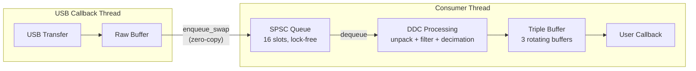
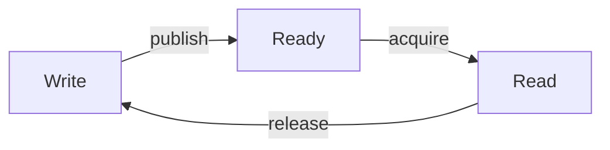

# libhydrasdr

A high-performance Software Defined Radio (SDR) library for HydraSDR devices.

## Overview

libhydrasdr is the core library for interfacing with HydraSDR hardware.

It provides:
- **Device Control**: USB communication, configuration, and streaming
- **Digital Down Converter (DDC)**: High-performance IQ conversion with multiple filter options
- **Streaming Infrastructure**: Lock-free SPSC queues, buffer pools, and triple buffering
- **Cross-Platform Support**: Linux, Windows, macOS, and Android

## DDC Filter Configurations (v1.1.0)

| Config      | Taps | Delay | Rejection | Use Case                    |
|-------------|------|-------|-----------|------------------------------|
| 33_FAST     |  33  |   8   |  ~62 dB   | Low latency, branchless      |
| 47_OPT      |  47  |  12   |  ~63 dB   | Default, Remez equiripple    |
| 65_POW2     |  65  |  16   |  ~66 dB   | Branchless wrap              |
| 83_HIGHPERF |  83  |  21   | >100 dB   | High dynamic range           |

## Streaming Architecture (v1.1.0)

The library uses a high-performance streaming pipeline optimized for low latency and minimal CPU overhead:



### SPSC Queue

Lock-free Single Producer Single Consumer queue for USB → Consumer data transfer:
- **Zero-copy**: Buffer pointers are swapped, not copied
- **Wait-free producer**: USB callback never blocks
- **16 slots**: Absorbs timing jitter between USB and processing

### Triple Buffer

Provides buffer safety for processed sample types (FLOAT32_IQ, INT16_IQ, etc.):
- **3 rotating buffers**: Write, Ready, Read
- **Callback safety**: User callback can hold its buffer while next buffer is processed
- **No blocking**: Producer and consumer never wait for each other



### RAW Mode

For `HYDRASDR_SAMPLE_RAW` and `HYDRASDR_SAMPLE_UINT16_REAL`, data passes directly from the SPSC queue to the callback without triple buffering.
Users requiring buffer persistence should copy the data within the callback.

## DDC Decimation Support (v1.1.0)

The library automatically generates virtual sample rates from hardware rates using cascaded halfband decimation (2x to 64x). This is **transparent** to the application.

**Important**: Always query available sample rates with `hydrasdr_get_samplerates()` - never hardcode values as they are device-specific.

```c
// Query all available rates (device-specific, includes decimated rates)
uint32_t count;
hydrasdr_get_samplerates(dev, &count, 0);
uint32_t *rates = malloc(count * sizeof(uint32_t));
hydrasdr_get_samplerates(dev, rates, count);

// Set a rate from the available rates - library handles decimation automatically
hydrasdr_set_samplerate(dev, rates[0]);  // Select from available rates
```

### Available Sample Rates (RFOne)

The library selects the **lowest hardware rate** by default (minimizes USB bandwidth):

| Effective Rate | HW Rate | Decimation |
|----------------|---------|------------|
| 10 MSPS | 10 MSPS | 1x |
| 5 MSPS | 5 MSPS | 1x |
| 2.5 MSPS | 2.5 MSPS | 1x |
| 1.25 MSPS | 2.5 MSPS | 2x |
| 625 kSPS | 2.5 MSPS | 4x |
| 312.5 kSPS | 2.5 MSPS | 8x |
| 156.25 kSPS | 2.5 MSPS | 16x |
| 78.125 kSPS | 2.5 MSPS | 32x |
| 39.0625 kSPS | 2.5 MSPS | 64x |

## Decimation Mode Selection (v1.1.0)

Two decimation strategies are available via `hydrasdr_set_decimation_mode()`:

| Mode | Strategy | Example (625 kSPS) | USB BW | Stages |
|------|----------|-------------------|--------|--------|
| **Low Bandwidth** (default) | Lowest HW rate | 2.5 MSPS / 4x | ~10 MB/s | 2 |
| **High Definition** | Highest HW rate | 10 MSPS / 16x | ~40 MB/s | 4 |

```c
// Query available sample rates and bandwidths first (device-specific)
uint32_t rate_count, bw_count;
hydrasdr_get_samplerates(dev, &rate_count, 0);
uint32_t *rates = malloc(rate_count * sizeof(uint32_t));
hydrasdr_get_samplerates(dev, rates, rate_count);

hydrasdr_get_bandwidths(dev, &bw_count, 0);
uint32_t *bandwidths = malloc(bw_count * sizeof(uint32_t));
hydrasdr_get_bandwidths(dev, bandwidths, bw_count);

// High Definition mode for better signal quality
hydrasdr_set_decimation_mode(dev, HYDRASDR_DEC_MODE_HIGH_DEFINITION);
hydrasdr_set_samplerate(dev, rates[i]);  // Select from available rates

// For maximum quality: combine with narrow RF bandwidth
hydrasdr_set_decimation_mode(dev, HYDRASDR_DEC_MODE_HIGH_DEFINITION);
hydrasdr_set_bandwidth(dev, bandwidths[0]);  // Select from available bandwidths
hydrasdr_set_samplerate(dev, rates[i]);  // Select from available rates
```

**Use cases**:
- **Low Bandwidth**: Battery-powered devices, USB 2.0 hubs, mobile applications
- **High Definition**: Desktop SDR, weak signal work, high dynamic range requirements

## Auto-Bandwidth Selection (v1.1.0)

The library automatically selects optimal RF bandwidth when `hydrasdr_set_samplerate()` is called:

| Scenario | Behavior |
|----------|----------|
| `hydrasdr_set_samplerate()` only | Auto-selects smallest BW >= hardware sample rate |
| `hydrasdr_set_bandwidth()` then `hydrasdr_set_samplerate()` | Uses manual BW (no auto) |

**Algorithm**: Finds the smallest available bandwidth that is >= **hardware** sample rate (not effective rate).

### Tuner Bandwidth Limitation

The tuner's IF filter (R820T/R828D) is only properly centered when the bandwidth matches the hardware sample rate. Setting a narrower bandwidth than the hardware rate causes the filter to be **off-center**, resulting in asymmetric frequency response.

| Mode | HW Rate | BW Setting | Filter Centering |
|------|---------|------------|------------------|
| Low Bandwidth | 5 MHz | 5 MHz | ✅ Centered |
| High Definition | 10 MHz (2x dec) | 10 MHz | ✅ Centered |
| High Definition | 10 MHz (2x dec) | 5.4 MHz | ⚠️ Off-center (usable) |

**Auto mode**: Selects BW matching hardware rate for optimal filter centering.

**Manual override**: Users can manually select a narrower bandwidth for better out-of-band rejection, accepting the off-center filter tradeoff. This is particularly useful with high decimation ratios:

| Effective Rate | HW Rate | Dec | Auto BW | Manual BW Option |
|----------------|---------|-----|---------|------------------|
| 312.5 kHz | 10 MHz | 32x | 10 MHz | 5.4 MHz (better rejection) |
| 625 kHz | 10 MHz | 16x | 10 MHz | 5.4 MHz (better rejection) |

**Tradeoff**: Narrower manual BW provides better analog pre-filtering at the cost of slightly off-center response. The DDC decimation filters handle the final bandwidth reduction digitally, so the off-center effect is often acceptable for narrowband applications.

```c
// Auto-bandwidth: library selects optimal BW
hydrasdr_set_samplerate(dev, 2500000);  // Auto-selects BW >= 2.5 MHz

// Manual bandwidth: user controls BW explicitly
hydrasdr_set_bandwidth(dev, 1750000);   // Set 1.75 MHz BW
hydrasdr_set_samplerate(dev, 2500000);  // Uses manual BW, no auto-selection
```

### Effective ADC Resolution Gain (v1.1.0)

Oversampling and decimation provide processing gain (Shannon/Nyquist theory):
- **Processing gain**: `SNR = 10 × log₁₀(N)` dB
- **Effective bits gained**: `ΔBits = 0.5 × log₂(N)`

| Decimation | Processing Gain | Bits Gained |
|------------|-----------------|-------------|
| 2x | 3.0 dB | +0.5 bits |
| 4x | 6.0 dB | +1.0 bit |
| 16x | 12.0 dB | +2.0 bits |
| 64x | 18.1 dB | +3.0 bits |

**Combined example** (625 kSPS with High Definition + narrow BW on RFOne):
- Base ADC: 12-bit (10.5 ENOB)
- 10 MSPS / 16x decimation: +12 dB (+2 bits)
- Narrow BW (~1.7 MHz) vs 10 MHz: ~7.7 dB (~1.3 bits)
- **Total**: ~20 dB improvement, 10.5 → **~13.8 ENOB** (equivalent to 18-bit ADC)

## Query Current Configuration (v1.1.0)

`hydrasdr_get_device_info()` can be called at any time, including during streaming, to query current configuration state:

```c
hydrasdr_device_info_t info;
hydrasdr_get_device_info(dev, &info);

// Current streaming configuration
printf("Effective rate: %u Hz\n", info.current_samplerate);
printf("Hardware rate:  %u Hz\n", info.current_hw_samplerate);
printf("Decimation:     %ux (%s mode)\n",
       info.current_decimation_factor,
       info.current_decimation_mode ? "High Definition" : "Low Bandwidth");
printf("Bandwidth:      %u Hz (%s)\n",
       info.current_bandwidth,
       info.bandwidth_auto_selected ? "auto" : "manual");
printf("Sample type:    %u\n", info.current_sample_type);
printf("Packing:        %s\n", info.current_packing ? "12-bit" : "16-bit");
```

### Current Configuration Fields

Fields ordered to match typical API call sequence: `decimation_mode` → `bandwidth` → `samplerate`

| Field | Description |
|-------|-------------|
| `current_decimation_mode` | 0=Low Bandwidth, 1=High Definition |
| `current_packing` | 0=16-bit, 1=12-bit packed |
| `bandwidth_auto_selected` | 1 if bandwidth was auto-selected, 0 if manual |
| `current_decimation_factor` | Decimation factor (1, 2, 4, 8, 16, 32, or 64) |
| `current_bandwidth` | Currently selected RF bandwidth in Hz |
| `current_samplerate` | Effective sample rate in Hz (after decimation) |
| `current_hw_samplerate` | Actual hardware/ADC sample rate in Hz |
| `current_sample_type` | Current sample type (enum hydrasdr_sample_type) |

## Thread Safety

- Device enumeration/opening: **NOT** thread-safe
- Device control (after open): **Thread-safe**
- Callbacks run in a dedicated thread
  - **Windows**: Elevated to `THREAD_PRIORITY_HIGHEST`
  - **Linux/macOS**: Normal priority (lock-free buffering handles timing jitter)

## Callback Timing (v1.1.0)

The SPSC queue provides headroom before data loss:

| Sample Rate | Buffer Interval | Queue Headroom (16 buffers) |
|-------------|-----------------|----------------------------|
| 10 MSPS | ~6.5 ms | **~105 ms** |
| 5 MSPS | ~13 ms | **~210 ms** |
| 2.5 MSPS | ~26 ms | **~420 ms** |

**Rule of thumb**:
- Occasional processing up to queue headroom time is safe
- For consistent processing, stay under the buffer interval
- Heavy DSP should be offloaded to another thread

Monitor streaming health:
```c
hydrasdr_streaming_stats_t stats;
hydrasdr_get_streaming_stats(dev, &stats);
printf("Buffers: received=%llu, processed=%llu, dropped=%llu\n",
       stats.buffers_received, stats.buffers_processed, stats.buffers_dropped);
```

## Building

See the parent directory README.md for complete build instructions.

### Quick Start (Linux/macOS)

```bash
mkdir build && cd build
cmake ..
make
```

### Quick Start (Windows with MSYS2/MinGW64)

```bash
mkdir build && cd build
cmake .. -G "Ninja"
ninja
```

## License

This library uses dual licensing:

- **MIT License**: Most files (see LICENSE.md for complete list)
- **BSD-3-Clause**: `hydrasdr.h` and `hydrasdr.c` (multi-author heritage)

Both licenses are permissive and compatible. See [LICENSE.md](LICENSE.md) for details.

## Links

- HydraSDR: https://www.hydrasdr.com
- Based on concepts from the HackRF project: https://greatscottgadgets.com/hackrf/
